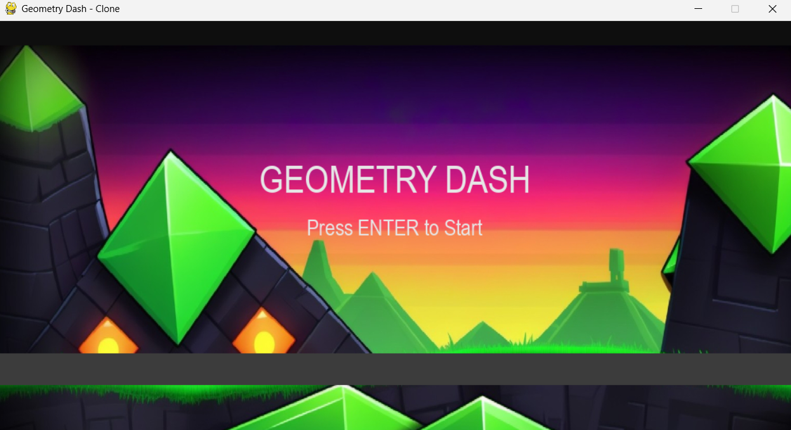
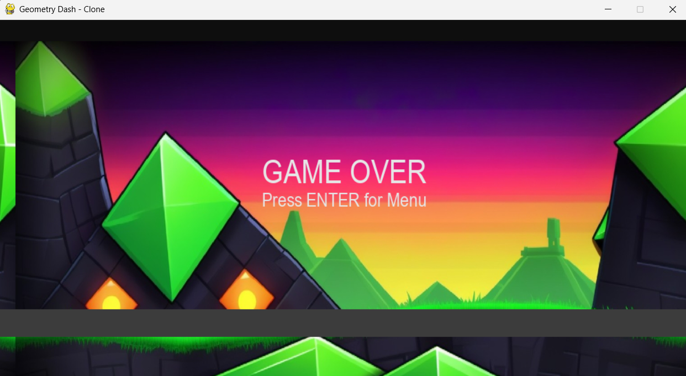

# Geometry Dash Clone

A simple Geometry Dash clone built with Python and Pygame.

## Features

- Infinite level generation after custom level ends
- Jumping, rotating player cube
- Obstacles with black fill and white borders
- Moving background and visible ground path
- Score and high score tracking (with persistent save)
- Sound effects for jump, hit, and score milestones

## Requirements

- Python 3.8+
- [Pygame](https://www.pygame.org/) (`pip install pygame`)

## Getting Started

1. **Clone this repository:**
    ```sh
    git clone https://github.com/AnshSingh16/Geometry_dash_clone_game.git
    cd geometry-dash-clone/src
    ```

2. **Install dependencies:**
    ```sh
    pip install pygame
    ```

3. **Add assets:**
 **NOTE: I have already added my own sounds but if you like you can tweak it out with some of your own creativity.**
    - Place your sound files (`jump.wav`, `hit.wav`, `score.wav`, `bg_music.mp3`), player image (`player.png`), and background image (`background.png`) in the `assets` folder.
    - Place your level files (`.json`) in the `levels` folder. Example level structure:
      ```json
      {
        "spawns": [
          {"x": 600, "w": 40, "h": 40, "kind": "block"},
          {"x": 900, "w": 40, "h": 40, "kind": "spike"}
        ],
        "bg_color": [30, 30, 35],
        "music": "bg_music.mp3"
      }
      ```

4. **Run the game:**
    ```sh
    python main.py
    ```

## Controls

- **Space**: Jump
- **Enter**: Start/Restart from menu or game over

## Customization

- Edit `settings.py` to tweak player size, gravity, jump velocity, etc.
- Add or edit level files in the `levels` folder for custom obstacle layouts.

## High Score

- The game saves your high score in `highscore.txt` in the project directory.

## Preview
 
 
 
 


## License

MIT License

Copyright (c) 2025 Ansh Singh

Permission is hereby granted, free of charge, to any person obtaining a copy
of this software and associated documentation files (the "Software"), to deal
in the Software without restriction, including without limitation the rights
to use, copy, modify, merge, publish, distribute, sublicense, and/or sell
copies of the Software, and to permit persons to whom the Software is
furnished to do so, subject to the following conditions:

The above copyright notice and this permission notice shall be included in all
copies or substantial portions of the Software.

THE SOFTWARE IS PROVIDED "AS IS", WITHOUT WARRANTY OF ANY KIND, EXPRESS OR
IMPLIED, INCLUDING BUT NOT LIMITED TO THE WARRANTIES OF MERCHANTABILITY,
FITNESS FOR A PARTICULAR PURPOSE AND NONINFRINGEMENT. IN NO EVENT SHALL THE
AUTHORS OR COPYRIGHT HOLDERS BE LIABLE FOR ANY CLAIM, DAMAGES OR OTHER
LIABILITY, WHETHER IN AN ACTION OF CONTRACT, TORT OR OTHERWISE, ARISING FROM,
OUT OF OR IN CONNECTION WITH THE SOFTWARE OR THE USE OR OTHER DEALINGS IN THE
SOFTWARE.

**Enjoy the game! Share it with your friends or show it in your college project.**

## IF YOU HAVE SOME YOUR IDEA TO MAKE IT UNIQUE. BE SURE TO TAG ME TO MY LINKEDIN AND GITHUB!
## LinkedIn: www.linkedin.com/in/anshsinghai  